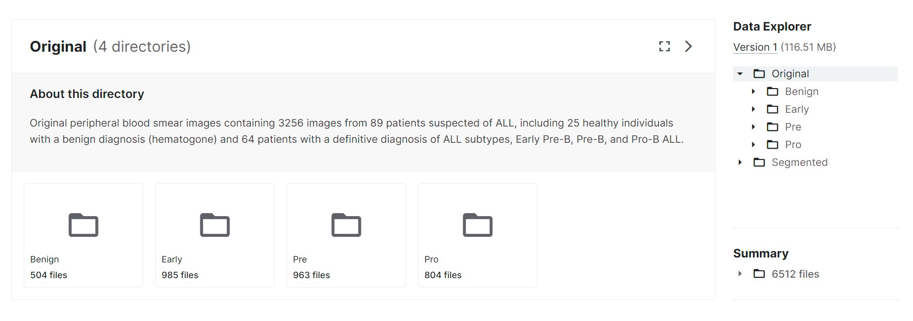
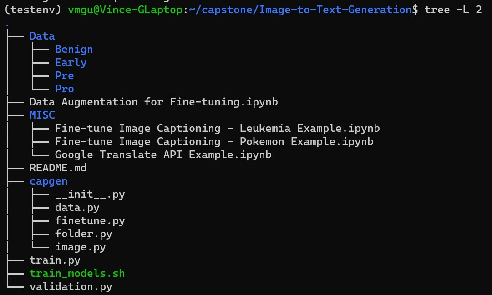

# Image-to-Text-Generation

## Setup (Model Predictions)
This first part of the README lists the steps required to take to make model predictions with the fine-tuned model

1. Clone this repo and create a ./Data folder in the root
    - Copy over the *Original* blood smear images from https://www.kaggle.com/datasets/mehradaria/leukemia?resource=download into the ./Data folder

    - You should have the following folder structure:

2. Prepare the following environment:
    - Python: 3.10.10
        - jiwer: 3.0.3
        - pandas: 2.0.2
        - pillow: 9.5.0 (PIL)
        - scikit-learn: 1.2.2 (sklearn)
        - torch: 2.0.1
        - torchvision: 0.15.2
        - tqdm: 4.65.0
        - transformers: 4.34.0
3.

train.py will generate altered image from ./Data/* and train a model which will be stored in ./mymodels
- ./mymodels is on the .gitignore because models get big, but don't worry train.py will make that dir if you don't have it
- see ./train_models.sh for an example of the parameters the custom train method takes

validation.py will make a csv of predictions in ./mymodels/Predictions
- again, no need to create ./mymodels/Predictions this file will do it for you
- after you train some models, they will populate in ./mymodels - you will have to specify which model you want to make predictions for 

### Environment

