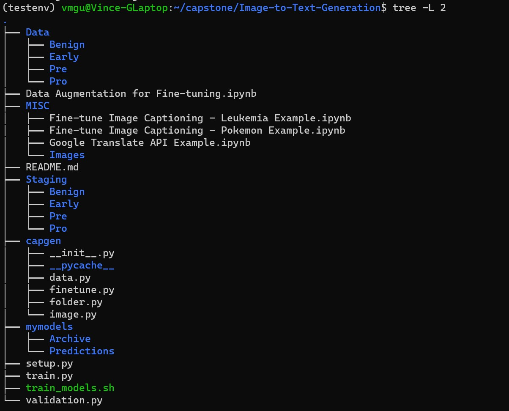

# Image-to-Text-Generation

## Making Model Predictions
This part of the README lists the steps required to take to make model predictions with the fine-tuned model

1. Clone this repo and create a ./Data folder in the root
    - Copy over the *Original* blood smear images from https://www.kaggle.com/datasets/mehradaria/leukemia?resource=download into the ./Data folder

    - You should have the following folder structure under ./Data:

2. Prepare the following environment:
    - Python: 3.10.10
        - jiwer: 3.0.3
        - opencv-python: 4.8.0.76 (cv2)
        - pandas: 2.0.2
        - pillow: 9.5.0 (PIL)
        - scikit-learn: 1.2.2 (sklearn)
        - torch: 2.0.1
        - torchvision: 0.15.2
        - tqdm: 4.65.0
        - transformers: 4.34.0
3. Run 'python setup.py'
    - You should now have the following folder structure under ./Staging and ./mymodels:

4. Copy pre-trained model into ./mymodels/Archive
    - You can download the model from: https://drive.google.com/drive/u/1/folders/1aF8GOuThN9ye2JAc6N5DeuOeLEMjpGN-
    - **TODO Do we want these models to be opensource?**
5. You should now be able to run 'python predictions.py' which will print out a prediction for a specified image (and maybe some logging too)
    - By default, this model will point to the fine-tuned model you just copied over to ./mymodels/Archive and the first image in ./Data/Benign
        - This default image is an unaltered image that should print the caption "good blood smear"
    - You can update line 19 in predictions.py to change the image you're making a prediction for and the model you're using to make that prediction

## Running Model Validation
Run 'python validation.py' to select 100 random images from each class/alteration combo (e.g. Benign class/blur alteration) and predicts a caption for each of them.

- Creates both a csv and html model metrics report in ./mymodels/Predictions/
    - The csv report is an exhaustive list of all images/actual captions/predicted captions
    - The html report is a table mapping each actual caption to the model predictions
- Note that actual captions are listed in shorthand

## Training the Model
This part of the README lists the steps required to train a new model. It's assumed you've already ran through initial setup under "Making Model Predictions"

1. Run ./train_models.sh
- This shell script calls train.py with parameters for batch size, learning rate and weight decay
    - By default, the only lines in the shell script that are uncommented are the best performing training parameters
    - The trained models will be placed into ./mymodels after training
    - Over 10 epochs and 20-25 mins per epoch, it will take several hours to train each iteration of the model
    
## Appendix
- ./Data, ./Staging, ./mymodels are all on the gitignore due to folder size (tens of thousands of images and large model files)
- ./capgen is a custom python module to handle folder structure, image and caption data and the fine-tuning of the model
    - ./folder.py handles gitignore folder structure
    - ./data.py handles generating alteration class combinations, selecting random images and generating image alteration parameters
    - ./image.py applies image alterations
    - ./finetune.py houses the Microsoft GIT model that we will be fine-tuning with our custom image/text pairs